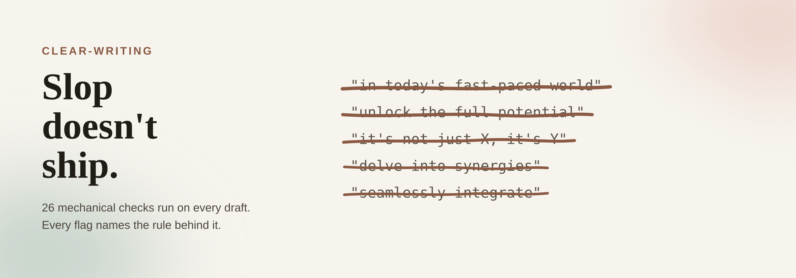

# clear-writing



It reported the draft clean. An em dash was still sitting inside a client's inbox.

*The LinkedIn carousel system this banner comes from lives in [collaterals-creator](https://github.com/ThorstenWeberGER/collaterals-creator/tree/main/linkedin-carousel), a separate repo.*

A Claude Code skill that applies a fixed ruleset whenever prose gets written or edited, then **verifies mechanically that the rules were actually applied**. That second half is the point. An earlier version reported its passes as run while shipping em dashes and an agentless passive in the same draft. That is why roughly a third of this skill is now enforcement rather than guidance.

- **Install:** `./install.sh` from the repo root. Symlinks the skill and the ground rules into `~/.claude/`, so a `git pull` updates every machine. `--status` shows what is linked, `--force` replaces an existing `CLAUDE.md` after backing it up, `--uninstall` removes the links.
- **Invoke:** the skill triggers on any request to write, draft, summarise, or edit English prose. `skills/clear-writing/SKILL.md` is the entry point.
- **Verify:** `python3 skills/clear-writing/check.py DRAFT.md [flags]`. Exit 0 means no FAILs.
- **Test the skill itself:** `./skills/clear-writing/tests/test.sh`. Drift test plus 12 fixture assertions.

Paths in this file are relative to the repo root. Paths inside the skill's own files are relative to `skills/clear-writing/`, which is what gets symlinked into `~/.claude/skills/`.

---

## 1. Pick the mode first

This is the single most important operational fact, and getting it wrong is the most common way to produce an unwanted result.

| | **Style-only** (default) | **Full** |
|---|---|---|
| Trigger | "write X", "clean this up", "does this read well", "make it sound like me" | "summarise", "recommend", "write the update for my boss", "turn this into a one-pager" |
| Runs | plain wording + `DONTS.md` + `humanizer.md` | the whole pass order |
| Restructures? | **No.** No reordering, no compressing, no cutting, no merging paragraphs, no imposed format | Yes, that is the job |
| Verify with | `check.py DRAFT.md --compare ORIGINAL.md` | flags matching the format |

**Style-only is the default because compression is the failure mode people don't ask for.** If the structure genuinely hurts the text, the skill says so in one sentence and leaves the decision to you rather than acting on it. The `--compare` guard fails a draft that lost more than 15% of the original's words: a real style edit measures +4%, a compressed rewrite of the same text measures −59%.

When in doubt it picks style-only. Full mode needs an explicit signal.

---

## 1b. Making these rules apply to every conversation

A skill only loads when it triggers. Some rules must hold in every reply, including ones where no writing task was requested, so they live one layer up in `CLAUDE.md`.

| Layer | Location | Holds | Cost |
|---|---|---|---|
| **Always on** | `~/.claude/CLAUDE.md` | The six ground rules below | Context on every turn, which is why it stays at six |
| **Project** | `<repo>/CLAUDE.md` | Repo conventions, pointer to the skill | Per-project only |
| **On demand** | `~/.claude/skills/clear-writing/` | The full ~23,000 words | Loaded when writing starts |

### To turn it on

```bash
git clone <this repo> && cd writing-skills
./install.sh              # symlinks the skill and CLAUDE.md into ~/.claude/
./install.sh --status     # shows what is linked and whether you are behind upstream
```

Symlinks, not copies, so `git pull` updates every machine at once. If you already have a `~/.claude/CLAUDE.md`, the installer **refuses to touch it** and tells you to merge by hand, because overwriting it would silently drop rules you rely on. `--force` backs it up with a timestamp first.

### The six rules

Each was selected by one test: **did this fail in practice, and did it fail silently?** Every one has a named incident behind it in `docs/v2-checklist.md`.

1. **No em dashes.** Not `—`, not `–`, not a spaced hyphen used as one. Run a literal character scan; this rule has been reported as applied while being violated in the same message.
2. **Jargon tests apply to chat replies, not just to drafts.** Shared, non-substitutable, canonical, referential. "Dogfooding" failed three of four and shipped repeatedly.
3. **Never generalise from one or two samples.** Say "one sample" when it is one. A finding held across two sources and broke on the third three times in this project.
4. **Report what you ran, not that you applied something, and never narrate your own care.** A command and its output are facts; diligence is not. Includes the sharpest form, **virtue by invented contrast**: "X rather than Y" where nobody proposed Y. Delete from "rather than" onward; if only the implication of thoughtfulness is lost, cut it.
5. **Invent no specifics.** No date, number, name, or quotation absent from the source. Use a placeholder and flag it.
6. **Do not infer traits about people from their writing.** Frequency counts are fine; conclusions about nationality, first language, seniority or state of mind are not.

Rules 1, 4 and 5 have mechanical backing in `check.py`. Rules 2, 3 and 6 are judgment, checked in `CHECKLIST.md`.

### Why six and not sixteen

Everything in `CLAUDE.md` costs context on every single turn, whether or not the turn involves writing. That is the whole reason the detailed guidance stays in the skill and only rules that fail *silently* are promoted. If a rule can wait until writing begins, it belongs in `references/`.

## 2. Architecture

The repo has three layers, and the split matters: only the middle one gets installed.

```
.
├── README.md             this manual
├── CLAUDE.md             the six always-on ground rules (section 1b)
├── install.sh            symlinks the skill + CLAUDE.md into ~/.claude/
├── docs/
│   ├── how-to-derive-a-style-guide.md   the transferable method
│   ├── research-styleguide-design.md    what the research found
│   ├── v2-checklist.md   build status and open work
│   └── backlog.md        the original wishlist. Also voice-sample Source 1
└── skills/clear-writing/ the skill itself. This whole directory is what installs
```

Everything the skill needs at runtime lives under `skills/clear-writing/`, because `install.sh` symlinks that one directory. A file moved above it stops being visible to the installed skill, which is why `docs/` holds only material the skill never reads.

```
skills/clear-writing/
├── SKILL.md              entry point: mode choice, then the pass order
├── CHECKLIST.md          the exit gate. Judgment checks a script cannot make
├── check.py              26 checks plain, up to 40 with flags. stdlib only
├── evals/                six baseline cases in the documented eval format
├── references/           the ruleset, loaded on demand
│   ├── foundations.md    always applies: find the point, why it matters, plain wording
│   ├── formats.md        deliverable shape: management summary, email, short article
│   ├── audiences.md      deltas per reader + when jargon is correct
│   ├── house-styles.md   which profile to pick, and what one cannot give you
│   ├── house-voices.md   the four profiles: every measured number, plus generators
│   ├── DONTS.md          growing list of specific things to avoid
│   └── humanizer.md      final anti-AI-slop pass
├── inputs/               material you supply. The only part that grows with use
│   ├── voice-sample.md   your own writing, verbatim, plus measured patterns
│   └── examples.md       real before/after pairs only. Never invented
├── templates/            README, installation, meeting notes + Diátaxis routing
└── tests/                maintenance only. The skill never reads these
    ├── test.sh           runs test_drift.py + all fixtures
    ├── test_drift.py     fails when check.py's wordlists drift from the docs
    └── fixtures/         drafts with known-correct FAIL counts
```

Three files sit at the skill's top level and the rest are grouped. `SKILL.md` has to be there (Claude Code loads it by name), `CHECKLIST.md` is read on every single draft, and `check.py` is the command you type most often. Everything read occasionally, supplied by you, or used only for maintenance went into a folder.

About 20,000 words of rules across `SKILL.md`, `CHECKLIST.md` and `references/`. `foundations.md` is the largest file because it carries the measured evidence for every rule, including which rules real publications contradicted.

### Full-mode pass order

1. **`foundations.md`**. Always. Find the strongest point (cluster related findings before ranking them), work out why it matters to *this* reader, then lead with it. Plus plain wording, sentence and paragraph limits, headings and lists.
2. **`formats.md`**. The deliverable's shape. Management summary (always paired with an email variant), or a short article. For notes and general prose, `foundations.md` alone is the whole ruleset.
3. **`house-styles.md`**. Only if you asked for a specific outlet's conventions. Skip otherwise.
4. **`audiences.md`**. What changes for a technical peer, an external client, non-native readers.
5. **`DONTS.md`** + **`inputs/examples.md`**. Known violations.
6. **`humanizer.md`**. The anti-slop pass, reading `inputs/voice-sample.md` for voice.
7. **`CHECKLIST.md`**. The gate. Not optional; it is what makes 1-6 real.

---

## 3. Inputs: what actually feeds this

Four inputs, three of which you control.

### `inputs/voice-sample.md`: your own writing

Verbatim quotes plus measured patterns. Currently: **median sentence 6 words, max 16, zero em dashes** across every sample, imperative mood dominant.

That zero-dash measurement is why the em-dash ban applies to you and `--dashes-ok` should never be passed.

**Known gap.** Both sources are short-form: a planning list and instructions. Neither is connected prose written for a reader, so paragraph openings and transitions fall back to defaults. `CHECKLIST.md` marks paragraph-level voice matching as *unsupported* rather than letting it be faked. **Two or three paragraphs of real prose you wrote for someone else would close this**, and it is the highest-value thing you can add.

To extend: append as Source 3, verbatim. The file records the rule that matters. Match rhythm and word choice, never reproduce typos.

### `DONTS.md`: your specific vetoes

A jargon table plus ten general don'ts. Grows when you flag something mid-conversation. Illustrative examples are fine here.

### `inputs/examples.md`: real pairs only

Holds only genuine before/after pairs from your writing or captured conversation. **Never invented ones**, which is why it stays separate from `DONTS.md`. Still at its 5 launch pairs; an empty slot is the honest state.

### `house-styles.md` and `house-voices.md`: measured publications

~25,000 words from The Economist, FT, Reuters and HBR, all supplied by you. This is where publication measurements live as *selectable targets*; `foundations.md` holds the same data as *evidence for or against our rules*.

---

## 4. How to use it for different purposes

| You want | Say | Flags | Notes |
|---|---|---|---|
| Reword my draft, don't restructure | "clean this up, don't shorten it" | `--compare original.md` | The default. Fails past 15% word loss |
| A management summary | "summarise this for my boss" | `--summary` | Auto-produces the email variant too |
| A management email | "write the email" | `--email` | ≤125 words, ≤5 prose sentences, CATEGORY subject |
| A client / incident note | "write the client update" | `--client` | Blocks fix-ETAs, empty apologies, vendor-blaming; requires a next-update time |
| A short article or docs page | "write this up as a one-pager" | `--article-half` or `--article-full` | Genre-routed subheads |
| For a mixed international team | add "for the international team" | `--nonnative` | Phrasal verbs, idioms, tense stacks |
| To imitate an outlet's shape | "write this like the Economist" | `--house economist\|ft\|reuters\|hbr` | Conventions, not voice |
| A README / install doc / meeting notes | "use the template" | none | See `templates/` |

Flags combine: `--email --client`, `--article-full --nonnative`.

### Worked example: a management email

```bash
python3 skills/clear-writing/check.py draft.md --email
```

Passing output looks like this fixture (`tests/fixtures/mgmt-email.md`, 101 words):

> **UPDATE: Warehouse migration slips two weeks, no decision needed yet**
>
> - Migration moves to 12 September, two weeks later than planned
> - Cause: undocumented assumptions in four legacy cron jobs
> - No budget or headcount impact; Q3 reporting dates unchanged
>
> The warehouse migration will finish on 12 September rather than 29 August. [...]
>
> Nothing is needed from you this week. If the date slips again I will flag it by 5 September.

Note what the shape does: a subject line that survives being forwarded alone, three bullets each standing as a fact the reader can act on, then prose. The bullet convention is borrowed from Reuters; the sentence length is not, because every publication measured writes sentences too long for a 125-word container.

### Which house style for an email?

**None of them whole.** The email cap of 125 words over 5 sentences implies a 25-word ceiling; Reuters' median is 30. Take the informational 7-14 word subject line from FT/Reuters, the summary bullets from Reuters, the sentence length from HBR's tips format (median 12), and reject every publication's sentence length. `house-styles.md` has the full transfer table.

---

## 5. Enforcement

Two halves, because only one of them can be automated.

### `check.py`: mechanical

Always-on: em/en dash scan, emoji, sentence and paragraph limits, sentence-length uniformity, passive voice, noun strings, hidden verbs, unfamiliar words, AI-tell density, buzzwords, stacked hedging, Title Case headings, bold mini-heading lists, FAQ sections, over-long lists.

Conditional on the flags above.

**Naming versus using.** Every pattern check runs on `under_judgment()`, one function that blanks contexts where a pattern is being *named* rather than *asserted*: code spans and fences, markdown table rows, weak/better demonstration lines, and quoted terms of six words or fewer. Length and structure metrics deliberately do not use it, because a table still occupies the page.

This single blind spot caused twelve false positives during development, each patched separately until the checks were consolidated. The exclusions are **reported, not silent** (`naming contexts excluded: 3 code span, 6 table row...`), because an invisible exclusion could hide a real violation, and `--strict` disables them. `tests/fixtures/naming-vs-using.md` locks both directions.

**FAIL must be fixed. REVIEW needs a recorded decision, not necessarily a change.** A flagged passive may be one of the two legitimate exceptions, a long list may genuinely have eight items.

Two checks are **density-aware or prescriptive rather than descriptive**, and knowing which is which matters:

- **AI-tell words** fail only when clustering (below 200 words per hit). HBR uses *crucial, landscape, fundamentally* at 1 per 644-787 words as ordinary register. Failing on a single hit flagged a benchmark publication.
- **Buzzwords** fail on presence, deliberately. `BUZZWORDS` lists words *we choose to avoid*, not words professionals avoid. HBR uses "circle back" and "actionable"; that is worth knowing and does not make them good choices.

### `CHECKLIST.md`: judgment

Six steps no script can decide: is this the strongest point, did the three-why chain run, is the triage stated, was uncertainty preserved, do the four jargon tests pass for this reader, and, **the item most likely to catch something real**, was any fact, number, or date added or dropped.

That last one has caught a genuine error three times, including a vague source reference ("approximately last Tuesday") silently rewritten as a specific date, which had survived two earlier review passes.

### `tests/test.sh`

```bash
./skills/clear-writing/tests/test.sh    # drift test + fixtures. Currently all green
```

`tests/test_drift.py` fails in three directions: a rule documented but not enforced, a term enforced but not documented, or a **broken rule anchor**: a rule `check.py` depends on that its reference file no longer states. Verified capable of failing by injecting each direction.

The suite also **runs the dash check over the skill's own prose**, plus this file and `CLAUDE.md`, and locks the number of dash characters the three scripts are allowed to contain. The rule was described across 20,000 words while 257 dashes sat in the files describing it, so it is now enforced rather than intended. Verified by injecting a violation of each guard.

CI runs this on any push touching the skill.

### `evals/`: the part `tests/` cannot measure

Every test in `tests/` runs inside the session that wrote the skill, which the Anthropic authoring docs name as the condition that masks gaps. `evals/evals.json` holds six cases in the documented format, each tied to a failure that actually happened in development, and each needing a fresh session with the skill disabled for the baseline arm. The number that matters is with-skill against without-skill, not the with-skill pass rate. `evals/README.md` has both ways to run them. They have not been run yet, and `docs/research-styleguide-design.md` records why.

---

## 6. Extending it

| To add | Where | Constraint |
|---|---|---|
| A thing to avoid | `DONTS.md`, then the matching list in `check.py` | The drift test fails if you do only one |
| A real before/after pair | `inputs/examples.md` | Must be genuine. Never invented |
| Voice material | `inputs/voice-sample.md` as a new Source | Verbatim. Report what it shows, not what it suggests about the writer |
| A house style | `house-styles.md` + the `HOUSE` dict in `check.py` | Needs measurements, not impressions |
| A new rule | the relevant `references/` file + a `check.py` check + a `RULE_ANCHORS` entry | Otherwise it is documentation nobody enforces |

**The drift test is the mechanism that keeps documentation and enforcement honest.** Change a wordlist in one place and it fails until you change the other.

---

## 7. Design decisions worth knowing

**Format matters more than publication.** HBR's tips list runs a 12-word median sentence against 19-22 in its own features. Same masthead, same editors. This is why `formats.md` routes on how a piece will be read rather than on who publishes it.

**"Zero subheadings" was wrong.** It held across nine Economist excerpts and four FT articles, then broke on Reuters and HBR, which both use subheads and summary bullets. Wire copy is written to be re-cut; a weekly feature is read end to end. The conditional rule survived; the universal claim did not. **This happened three times in development**, a finding holding on two sources and breaking on the third, and the pattern is recorded in-file as a caution.

**Rules that real publications contradicted, and lost:** the 3-6 bullet range (no primary support, now labelled house convention), "short words over long" (the real rule is familiarity), absolute active voice (two legitimate exceptions), "minimise abbreviations" (the real convention is gloss-then-use).

**Prescriptive vs descriptive.** The em-dash ban and the buzzword list are house preferences, stated as such: em dashes run from zero at Reuters to 1 per 157 words at HBR. The AI-tell list was descriptive and genuinely needed weakening. Conflating those two is how a style guide turns into superstition.

---

## 8. Known limits

- **`inputs/examples.md` is thin.** Only 5 pairs. Only real use fills it.
- **No connected-prose voice sample.** Paragraph-level voice matching is explicitly unsupported.
- **Passive and noun-string checks are heuristics**, not parsing. Hence REVIEW rather than FAIL.
- **The drift test's allowlists are large** (55 non-literal, 114 orphan-OK). Each is justified, but the escape hatch is big enough that adding to it is easier than fixing the coupling.
- **Mode selection is not enforced**, only documented. `--compare` catches unwanted compression only if someone passes it.
- **FT measurements are upper bounds.** Recovered from PDFs with no text layer, so captions interleave with body prose.
- **Templates are untested against real use.**

Full status in `docs/v2-checklist.md`.

---

## 9. Provenance

Plain-wording and list rules come from primary text in the publishers' own repositories: [GSA/plainlanguage.gov](https://github.com/GSA/plainlanguage.gov) and [18F/content-guide](https://github.com/18F/content-guide). Method rules generalise Minto's Pyramid Principle and SCQA, the Toyota five-whys (cut to three, aimed at audience relevance), and Jobs-to-be-Done's goal-plus-obstacle framing. Audience profiles draw on Google's engineering practices, Nygard's ADR template, incident-communication practice, Google's global-audience guidance, and Kohl's *Global English Style Guide*. Templates come from the standard-readme spec, The Good Docs Project, Robert's Rules, the GitLab handbook, and [Diátaxis](https://diataxis.fr/). `humanizer.md` is condensed from Wikipedia's *Signs of AI writing* via [blader/humanizer](https://github.com/blader/humanizer) (MIT).

Publication measurements come from articles supplied during development. No source text is stored here beyond quotations under 15 words. Per-rule attribution, including which rules each publication corrected, is in `references/foundations.md` under Sources.
